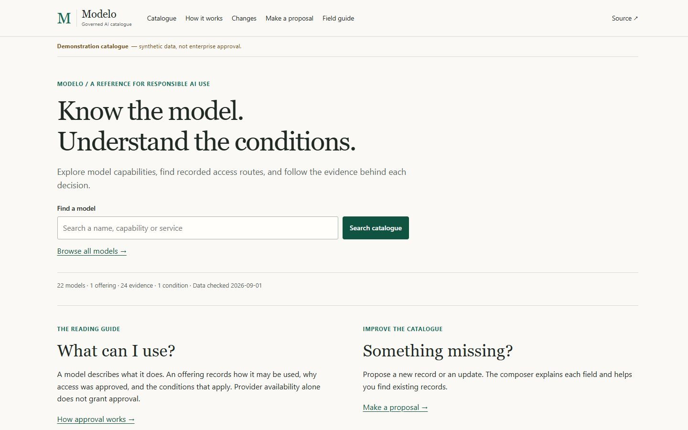
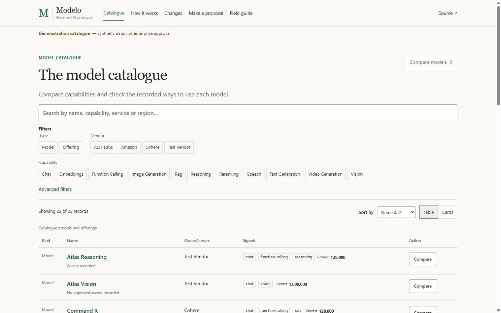

# Modelo

Modelo is a Git-backed approval ledger and static publication system for an
enterprise AI model catalogue. Model records describe facts. Offering records
carry consumption approval. Issues start work; change requests and trusted CI
decide them. There is no application API. Host-specific concerns stay in the
Git adapter layer, not in core records or schemas.

## Start Here

- Live synthetic demo: [j3brns996.github.io/Modelo/](https://j3brns996.github.io/Modelo/)
- Guided issue chooser: [Open a Modelo MAC request](https://github.com/j3brns996/Modelo/issues/new/choose)
  for add, change, revoke, move or batch requests.
- Repository rules and contracts: [SPEC.md](SPEC.md) and [docs/contract.yaml](docs/contract.yaml)

Demo records are synthetic, not enterprise approval. Catalogue work starts in
the issue chooser, which captures the intent and subjects the change request
must preserve.

## Product tour

These synthetic-demo captures are not approval, launch or T10 evidence and
contain no production data.





## Why Facts And Approval Are Separate

A model record describes a named model release; it does not permit enterprise
use. An offering is the approval unit, joining the model to provider routes,
policy rationale and evidenced conditions. This separation matters: provider
availability, documentation examples and public demos are observations, not
approval. Enterprise use follows the approved offering and route.

## Current Status

T8 pre-merge CI, T9 and the public synthetic Pages demo are implemented. The
synthetic demo is for the labelled demo slice only. Production post-merge
release and receipt automation, plus the T10 remote evidence gate, are still
blocked. No real production catalogue data is published, and agent approval is
disabled. The site guides readers and validates the static publication flow;
it does not claim launch completion.

Do not add real production catalogue data before T10 passes remotely.

## Choose Your Path

| If you want to... | Start here |
|---|---|
| Browse the live site | [Synthetic demo](https://j3brns996.github.io/Modelo/) |
| Start a proposed change | [Guided issue chooser](https://github.com/j3brns996/Modelo/issues/new/choose) |
| Draft an add or change | [Interactive proposal helper](https://j3brns996.github.io/Modelo/propose/#builder) |
| Use the local authoring commands | [Authoring guide](docs/authoring.md) |
| Learn how to contribute safely | [CONTRIBUTING.md](CONTRIBUTING.md) |
| Read the docs index | [docs/README.md](docs/README.md) |
| Understand the product rules | [SPEC.md](SPEC.md) |
| Inspect the machine contract | [docs/contract.yaml](docs/contract.yaml) |

## How A Change Is Decided

A proposal begins with a linked issue and continues on a topic branch with one
writer. The change request binds its operation to the exact base, head and tree
under review. Trusted CI validates that head; a missing, stale, skipped or
failed result cannot accept the change. Catalogue facts need admissible
evidence, while policy text explains why an offering is approved. Human
CODEOWNER approval remains required for control and documentation paths. A new
commit invalidates earlier check and review evidence.

## Five-Minute Setup

```bash
uv sync --locked
uv run --locked modelo --version
uv build --offline --no-cache
uv run --locked modelo-local-ci run --base <base-sha> --head <head-sha> --as-of YYYY-MM-DD --jobs 3
```

`modelo-local-ci` is advisory preflight only. It helps you compare a topic
branch with its base, but it does not accept a change. `modelo/check` remains
the acceptance gate. Use the exact base and head SHAs from your change request
so the result matches the reviewed head.

Candidate and final builds take explicit provenance inputs. `--base-commit`
names the comparison baseline; the matching source and tree values bind the
output to reviewed Git content. See [docs/contract.yaml](docs/contract.yaml)
for the required input set.

Authoring helpers prepare drafts only; the linked issue and trusted compiler
remain authoritative.

Run the command from a clean worktree after reading the repository rules and
the schema that owns the changed files. Start with narrow tests, then use local
CI for preflight. Never commit generated output from `dist/`.

## Four Planes

| Plane | Location | Purpose |
|---|---|---|
| Governed solution | `catalogue/`, `schemas/`, `modelo.yaml` | Reviewed source of truth |
| Build tooling | `tooling/modelo/`, `pyproject.toml`, `uv.lock` | Deterministic validation and generation |
| Static presentation | `site/` | Templates, content and local assets |
| Publication | `dist/` | Generated output, never committed |

## Configuration and validation authority

[`modelo.yaml`](modelo.yaml) owns configured repository paths, site and issue
routes, publication profiles, GitHub or GitLab adapter selection, platform
controls, toolchain pins and build inputs. The tooling loads those values.

Validation has separate, explicit owners. JSON schemas define record shapes
and provenance annotations. The Python validator enforces cross-record,
evidence and change semantics. [docs/contract.yaml](docs/contract.yaml) records
the compact machine contract, while [SPEC.md](SPEC.md) explains its rationale.
Configuration does not replace those shape or semantic authorities.

## Documentation Map

- [CONTRIBUTING.md](CONTRIBUTING.md) covers linked issues, topic branches,
  one-writer ownership and the local preflight flow.
- [docs/README.md](docs/README.md) is the repository docs index.
- [docs/authoring.md](docs/authoring.md) explains the browser and local drafting
  helpers and where their authority ends.
- [SPEC.md](SPEC.md) explains the product rationale, scope and invariants.
- [docs/contract.yaml](docs/contract.yaml) is the compact machine contract.
  Read it when you need the authoritative field, path and acceptance rules.

## Security And Reuse

- [SECURITY.md](SECURITY.md) is the security and recovery guidance.
- There is no root repository licence file yet.
- Reuse terms are undecided.
- Public visibility does not grant reuse rights.
- Do not post secrets, tokens or private evidence in issues, pull requests or
  public comments.
  If something belongs in the ledger, capture it through the governed
  workflow instead of copying it into chat or an ad hoc note.
