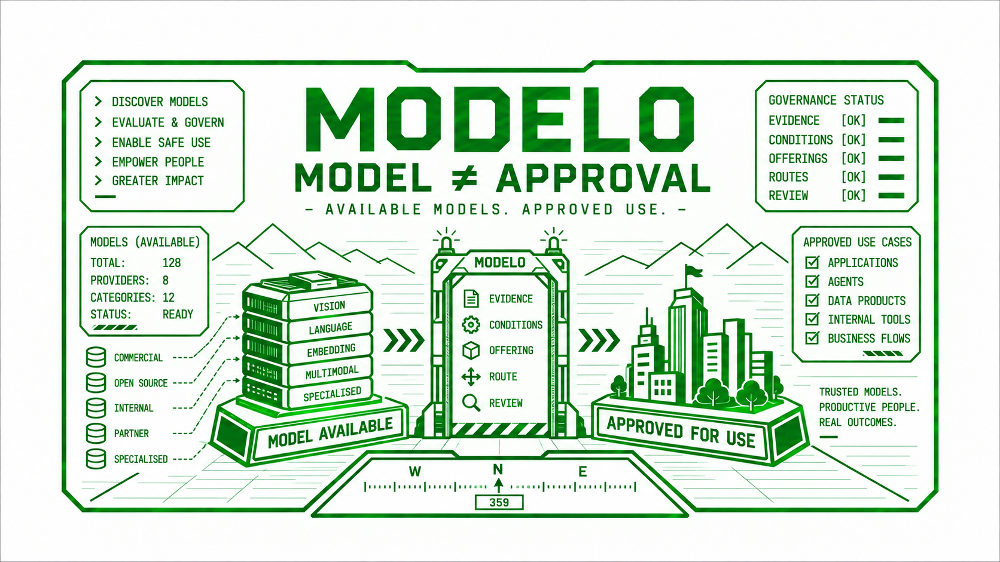

# Repository Documentation Map

This index is for repository contributors. It is not the published site route
at `/docs/`.

Concept illustration. Counts and status indicators are illustrative. Modelo
records offering approvals. Application owners govern specific uses.

## Read by question

Start with the [agent quickstart](agent-quickstart.md) for agent-led triage,
maintenance, and review handoff.

| If you are asking | Read | Kind |
|---|---|---|
| What is the executable contract? | [SPEC.md](../SPEC.md), [contract.yaml](contract.yaml) | Normative |
| What are the current repository rules? | [AGENTS.md](../AGENTS.md), [CONTRIBUTING.md](../CONTRIBUTING.md) | Current |
| How does MAC work? | [mac-contract.md](mac-contract.md) | Normative reference |
| How do I prepare a proposal or evidence draft? | [authoring.md](authoring.md) | Current guide |
| How does the static site work? | [site-contract.md](site-contract.md) | Normative reference |
| What is the security posture? | [security-contract.md](security-contract.md), [SECURITY.md](../SECURITY.md) | Current reference |
| What is the implementation and launch status? | [IMPLEMENTATION-PLAN.MD](IMPLEMENTATION-PLAN.MD), [launch-runbook.md](launch-runbook.md) | Current / historical |
| How should Windows developers run full checks? | [agent-quickstart.md](agent-quickstart.md) | Current guide |
| How does AWS Bedrock discovery work? | [providers/aws-bedrock.md](providers/aws-bedrock.md) | Reference |
| Where are dated review notes and decisions? | [reviews/](reviews/), [adr/](adr/) | Review evidence / historical |

## How to use the map

- [ELI21](eli21.md): model-release, Offering and AI-use distinctions.
- [NIST method equivalence](assurance/nist-ai-rmf-method-equivalence.md) and
  [machine mapping](assurance/nist-ai-rmf-mapping.yaml): bounded outcome support.
- [Maturity profile](assurance/modelo-maturity-profile.md): target, local, remote
  and operating evidence distinguished.
- [Embedded AI coverage](assurance/embedded-ai-coverage.md): external
  covered-by-parent policy, not exemption from governance.
- [Identity ADR](adr/0002-model-release-identity.md) and
  [inventory boundary/diagrams](adr/0003-ai-inventory-boundary.md).
- [Schema guide](schema-guide.md) and
  [canonical entity contract](adr/0003-entity-contract.md); the earlier NIST
  [implementation plan](reviews/nist-rmf-implementation-plan.md).

- Normative files define the rules the repository currently follows.
- Current files describe live process, posture or status.
- The authoring guide explains helpers; it does not grant approval or replace
  the executable contracts.
- Historical files explain past decisions and preserved evidence.
- Reference files provide domain-specific background.
- Review evidence records dated review output and decision context.
