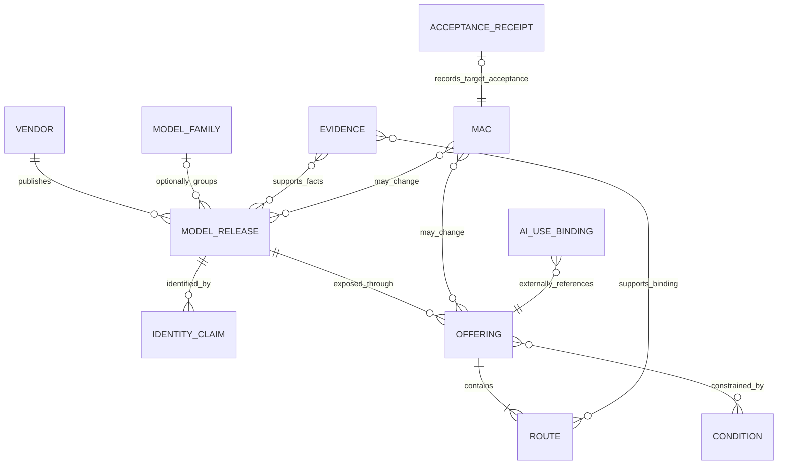
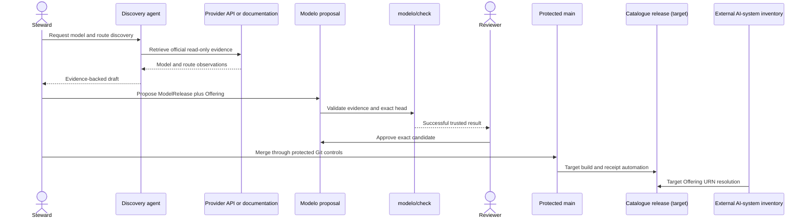

# Decision: Component registry, external AI-use inventory

Status: proposed for human CODEOWNER review. Issue: #70. Owner: j3brns.

Modelo owns ModelRelease, provider Offering, Route, Evidence, Condition and
acceptance/release provenance. The external inventory owns Application, AI Use,
Purpose, Owner, Affected parties, Data context, Human oversight, Lifecycle,
covered-by-parent determinations, and declared/observed use. No second approval
authority or application API is introduced.

## Minimal external reference contract

```yaml
kind: AIUseBinding
external_system_id: cmdb:business-application:BA012345
external_ai_use_id: aiuse:customer-call-summary
modelo_offering_urn: urn:modelo:offering:example-nova-bedrock
purpose: summarisation
environment: production
registration:
  authority: external-ai-system-inventory
  observed_at: 2026-09-01T10:00:00Z
```

This is a non-authoritative integration example, not a core catalogue entity
or production record. The external inventory resolves the URN to a current
accepted Offering at a recorded Git/release revision and checks its provenance,
Conditions and applicable route. A stale, missing or revoked reference requires
review; a cached URN is not lasting consumption permission. External owners
choose registration, reconciliation and escalation policies. Modelo does not
own application-specific business purposes, owners, oversight or invocation
telemetry. Offering approval_owner and approved_use record component approval
policy; they do not duplicate the external application-use inventory.

## Entity model



MODEL_RELEASE is the semantic meaning of existing Model. MODEL_FAMILY is only
optional internal grouping, not a registry/entity added here. IDENTITY_CLAIM is
nested evidenced vendor/provider identity. OFFERING remains the approval unit;
ROUTE holds provider-specific invocation coordinates. EVIDENCE supports external
claims and bindings; CONDITION holds versioned enterprise constraints. MAC,
exact-head CI, independent review and target release receipts embody acceptance.
AI_USE_BINDING is external. Cardinalities permit many MACs over a record's life
and models without an Offering; diagrams do not add entities to the kernel.

## Proposal sequence



The last two steps describe target integration: production postmerge automation
and external inventory integration are not implemented. Signatures are optional
adapter strengthening, not a universal implemented guarantee. Agents do not merge.

## Rejected alternatives and rollback

No CMDB, AI-use entity, telemetry store, workflow engine, DynamoDB, OPA/OPAL,
Cedar, Entra SPA or general API. Existing MAC/review/merge/receipt semantics do
not need GovernanceDecision, ReviewCase or ReviewOpinion duplicates. Coverage
policy and NIST mapping are assurance documents, not alternative permissions.
Revert these integration examples through ordinary review if the boundary
changes; no external inventory or production state is written by this change.
