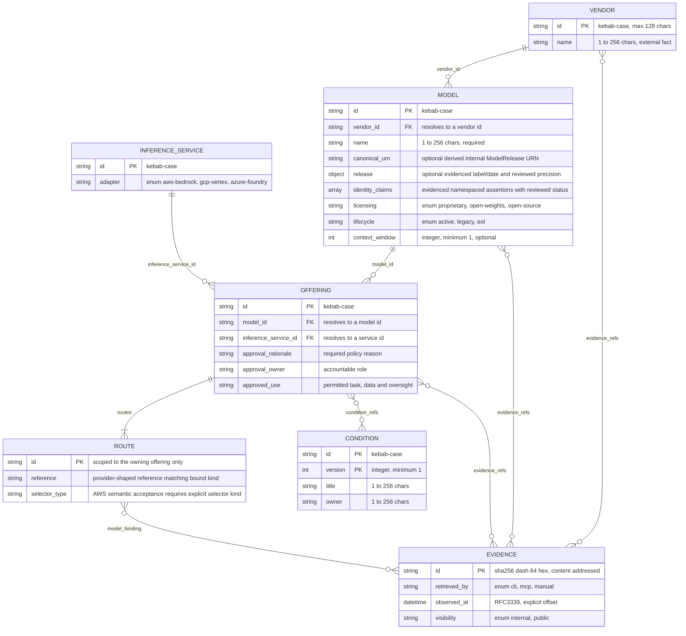

# Catalogue schema ledger

The entity schemas under `schemas/` govern the catalogue records Modelo publishes:
Vendor, Model, Inference Service, Offering, its embedded Route, Condition and
the terminal Evidence envelope. Every id — key or foreign key alike — matches
`common.schema.json#/$defs/id` (`^[a-z0-9](?:[a-z0-9-]*[a-z0-9])?$`, ≤128
chars), and every schema sets `additionalProperties: false`: an unlisted key
fails validation outright.

## Entity relationships

Evidence is terminal — nothing references outward from it. Externally sourced
facts trace back to it through `evidence_refs`. Enterprise policy and internal
references follow their schema annotations and semantic checks. Conditions
contain policy and do not carry evidence_refs.

## Canonical definitions

The [entity contract](adr/0003-entity-contract.md) maps paths, keys and source
schemas. The [schema guide](schema-guide.md) explains the current profile.
Field types, required properties and bounds belong to those schemas, not a
second manually maintained field table.

## What the diagram can't show

Model means a named ModelRelease. The additional identity fields, including
optional family grouping and supersession references, are defined in
`model.schema.json` and `model-release.schema.json`; see the
[schema guide](schema-guide.md) for identity maintenance, evidence requirements
and selector rules. This ledger is an overview, not a second schema definition.

**`evidence_refs` is a map, not a column.** Its keys are JSON Pointers into
the owning record, naming which field is backed; each value is
`{id, projection_pointer}`, pointing at an evidence id and a location inside
that evidence's own projection.

**A valid shape isn't a resolved reference.** Every PK and FK shares one id
pattern, so a `vendor_id` is schema-valid the moment it's well-formed.
Whether it names a vendor that actually exists is checked separately, by the
semantic pass in `tooling/modelo/src/modelo/validators.py`.

**A schema-valid route isn't a semantically dispatched one.** An offering's
`inference_service_id` resolves through the governed inference-service
registry to an `adapter`; only `aws-bedrock` has an implemented semantic
validator (evidence correlation, malformed-reference rejection, freshness).
An `aws-bedrock`-adapter offering whose routes include a schema-valid
`gcp-vertex`- or `azure-foundry`-shaped route fails that one route closed
with `UNKNOWN_REFERENCE` rather than crashing or silently passing; sibling
routes that do match the resolved adapter are unaffected. An offering
resolved to a `gcp-vertex` or `azure-foundry` service is itself schema-valid
but currently has no implemented validator at all — same diagnostic, same
fail-closed behaviour, until Phase 2 (see `docs/providers/gcp-vertex.md` /
`docs/providers/azure-foundry.md`).

## Audit notes

A schema-hygiene review of this set found and fixed one real duplication: the
AWS region pattern (`Route.source_region` above, and `evidence.schema.json`'s
`apiSource.region`) was independently copied in two files. It now lives once
as `common.schema.json#/$defs/awsRegion`, referenced by both.

Two further findings — collapsing `mac.schema.json`'s `digest` definition
into a `$ref` on `common.schema.json#/$defs/evidenceId`, and narrowing
`mac.schema.json`'s wider subject-`identity` character set to match the
catalogue `id` pattern — were reverted after the test suite showed both were
load-bearing: `mac.schema.json` is deliberately standalone-validatable (no
cross-file `$ref` may leave it), and the wider identity charset is what lets
`build.py`'s semantic layer be proven to reject path-smuggling subject
identities (`tests/unit/test_build.py::test_condition_and_offering_composite_subject_aliases_are_rejected`).
Both are instead pinned by regression tests in `tests/unit/test_schemas.py`
(`test_mac_digest_pattern_matches_common_evidence_id` and
`test_every_externally_sourced_field_has_a_valid_freshness_class`) so future
drift is still caught without weakening either property.

## Source schemas

`model.schema.json` · `offering.schema.json` · `evidence.schema.json` ·
`condition.schema.json` · `vendors-registry.schema.json` ·
`inference-services-registry.schema.json` ·
`providers/aws-bedrock-route.schema.json` ·
`providers/gcp-vertex.schema.json` · `providers/azure-foundry.schema.json` ·
`common.schema.json`
